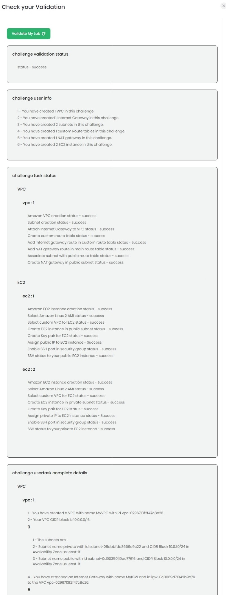
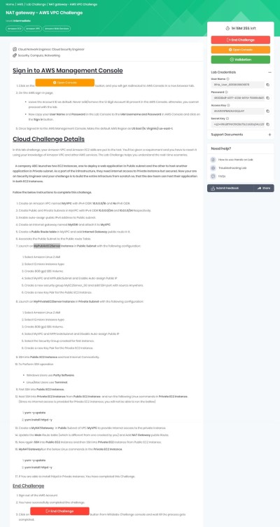

<h1 align="center">
Whizlabs Challenge League
</h1>

<h2 align="center">
Challenge Lab Four
</h2>

<h2 align="center">
NAT Gateway
</h2>

---

WhizLabs is running a cloud challenge between May and July 2022.  The challenge is to complete various tasks in either AWS, GCP, or Azure to test cloud skills.  Following is my solution to challenge lab four.

---
<h3>From Whizlabs</h3>

[Cloud Challenge Details](inst.jpg)

>In this lab challenge, your Amazon VPC and Amazon EC2 skills are put to the test. You'll be given a requirement and you have to reach it using your knowledge of Amazon VPC and other AWS services. The Lab Challenge helps you understand the real-time scenarios.
    A company ABC launches two EC2 Instances, one to deploy a web application in Public subnet and the other to host another application in Private subnet. As a part of the infrastructure, they need internet access to Private Instance but secured. Now your are an Security Engineer and your challenge is to build the entire Infracture from scratch so, that the dev team can host their application in both EC2 Instances.<br><br>
>Follow the below instructions to complete this challenge. 
>1.	Create an Amazon VPC named MyVPC with IPv4 CIDR: 10.0.0.0/16 and No IPv6 CIDR.
>2.	Create Public and Private Subnets in MyVPC with IPv4 CIDR 10.0.0.0/24 and 10.0.1.0/24 Respectively.
>3.	Enable auto-assign public IPv4 address to Public subnet.
>4.	Create an Internet gateway named MyIGW and attach it to MyVPC 
>5.	Create a Public Route table in MyVPC and add Internet Gateway public route in it. 
>6.	Associate the Public Subnet to the Public route Table.
>7.	Launch an MyPublicEC2Server Instance in Public Subnet with the following configuration:
>     1.	Select Amazon Linux 2 AMI 
>     1.	Select t2.micro instance type
>     2.	Create 8GB gp2 EBS Volume.
>     3.	Select MyVPC and MYPublicSubnet and Enable Auto-assign Public IP
>     4.	Create a new security group MyEC2Server_SG and add SSH port with source Anywhere.
>     5.	Create a new Key Pair for the Public EC2 Instance.
>8.	Launch an MyPrivateEC2Server Instance in Private Subnet with the following configuration:
>     1.	Select Amazon Linux 2 AMI 
>     1.	Select t2.micro instance type
>     2.	Create 8GB gp2 EBS Volume.
>     3.	Select MyVPC and MYPrivateSubnet and Disable Auto-assign Public IP
>     4.	Select the Security Group created for first instance.
>     5.	Create a new Key Pair for the Private EC2 Instance.
>9.	SSH into Public EC2 Instance and test Internet Connectivity.
>10.	To Perform SSH operation
>           1.	Windows Users use Putty Software.   
>         2.	Linux/Mac Users use Terminal.
>11.	First SSH into Public EC2 Instance.
>12.	Next SSH into Private EC2 Instance from Public EC2 Instance  and run the following Linux commands in Private EC2 Instance. (Since no internet access is provided for Private EC2 instances, you will not be able to run the bellow)
>           1.	yum -y update
>           1.	yum install httpd -y
>13.	Create a MyNATGateway  in Public Subnet of VPC MyVPC to provide Internet access to the private instance. 
>14.	Update the Main Route table (which is different from one created by you) and Add NAT Gateway public Route.
>15.	Now again SSH into Public EC2 Instance and then SSH into Private EC2 instance from Public EC2 instance.
>16.	MyNATGatewayRun the below Linux commands in the Private EC2 Instance.
>           1.	yum -y update
>           1.	yum install httpd -y
>17.	If You are able to install httpd in Private Instance, You have completed this Challenge.

---


Login into AWS and search/choose *VPC*.

Click *Launch VPC Wizard*.

<p align="center">
  
</p>

Select *VPC only*. Name the VPC ```MyVPC```.  Check *IPv4 CIDR manual input*.

Enter ```10.0.0.0/16``` for **IPv4 CIDR**.  Check *No IPv6 CIDR block*.

Click *Create VPC*.

<p align="center">
  
</p>

Select *Subnets* under **Virtual Private Cloud**.  Click *Create subnet*.

<p align="center">
  
</p>

Select *MyVPC* for **VPC ID**.  Click *Add a new subnet*.  Create and input names for both the public and private subnets.

For the public subnet, enter ```10.0.0.0/24``` for **IPv4 CIDR Block**.

For the private subnet, enter ```10.0.1.0/24``` for **IPv4 CIDR Block**.

Click *Create subnet*.

<p align="center">
  
</p>

Select the instsance and click *Connect* to get the SSH details.

<p align="center">
  
</p>

<p align="center">
  
</p>

Within Putty, in Session under Host Name, input ec2-user@*instance-public-dns*.

Under Connection > SSH > Auth > Authentication parameters > Private key file for authentication, broswe to and select the key file for the instance.

Within the terminal, input 


<code>sudo su\
yum update -y\
yum install httpd -y\
nano /var/www/html/test.html
</code>

With the nano editor, type <code>Whizlabs Test Page</code>.
Press ctrl + X, type Y and hit enter.


Back in AWS, navigate to **EC2** > **Elastic Block Store** > **Snapshots**, and click *create snapahot*.

<p align="center">
  
</p>


<p align="center">
  
</p>

Wait for the sanpshot to be created.

<p align="center">
  
</p>

<p align="center">
  
</p>

Under **Actions**, click *Create image from snapshot*.

<p align="center">
  
</p>

Input a name for the image and click *Create image*.

<p align="center">
  
</p>

Under **Images** > **AMIs** and **Actions**, click *Copy AMI*.

<p align="center">
  
</p>

Enter a name and click *Copy AMI*.

<p align="center">
  
</p>

Switch to *ap-south-1*  and wait for the copy to finish.

<p align="center">
  
</p>

Click *Launch instance from AMI*.

<p align="center">
  
</p>

Input a name.  From **My AMIs**, select the copied ami.  Create a new key pair and ensure SSH and HTTP trafffic are allowed.

Click *Launch instance*.

<p align="center">
  
</p>

<p align="center">
  
</p>

Lab is complete.

<p align="center">
  
</p>

<h1>Video Example</h1>

[](https://youtu.be/mga-aM83SJA)
